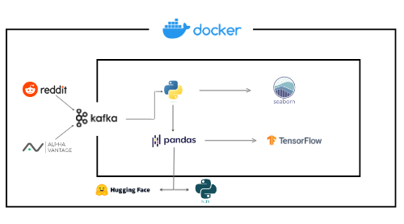

# Sentiment-Driven-Stock-Price-Predictor

## Stock Sentiment Kafka Pipeline

A real-time data pipeline that fetches stock market data, performs sentiment analysis using Reddit data, and streams the results to Kafka for downstream processing. The project integrates various APIs, including Alpha Vantage for stock data and Reddit (via PRAW) for sentiment analysis.

## Project Overview

This project is designed to capture stock market data in real-time, retrieve sentiment analysis from social media platforms (specifically Reddit), and produce the data through Kafka for further processing or storage.




Key features:
- **Stock Data Fetching**: Uses the Alpha Vantage API to fetch historical stock data.
- **Sentiment Analysis**: Retrieves sentiment data from Reddit posts related to specific stock symbols.
- **Kafka Producer**: Sends data to a Kafka topic for further processing or consumption.
- **Kafka Consumer**: Consumes data from Kafka and stores it in a PostgreSQL database or a CSV file for analysis.

## Project Structure
```
├──dashboard
│  └── app.py
├── data/
│   └── stock_data_with_sentiment.csv
├── models/
│   ├── analysis.ipynb
│   └── train.py
├── sentiment_analysis/
│   ├── fetch_sentiment.py
│   ├── nlp_sentiment.py
│   ├── sentiment.py
│   └── vader_sentiment.py
├── consumer.py
├── docker-compose.yml
└── producer.py
```

## Requirements

1. **Kafka**: Ensure you have a Kafka cluster running locally or remotely.
2. **Alpha Vantage API**: You'll need to sign up for an API key from [Alpha Vantage](https://www.alphavantage.co/).
3. **Reddit API (PRAW)**: You'll need to create a Reddit application at [Reddit Developer](https://www.reddit.com/prefs/apps) to obtain the `client_id`, `client_secret`, and `user_agent`.
4. **PostgreSQL**: (Optional) If you're using the consumer to store data in PostgreSQL, ensure your database is set up correctly.

### Install Dependencies

Install the required Python libraries using `pip`:

```bash
pip install -r requirements.txt

